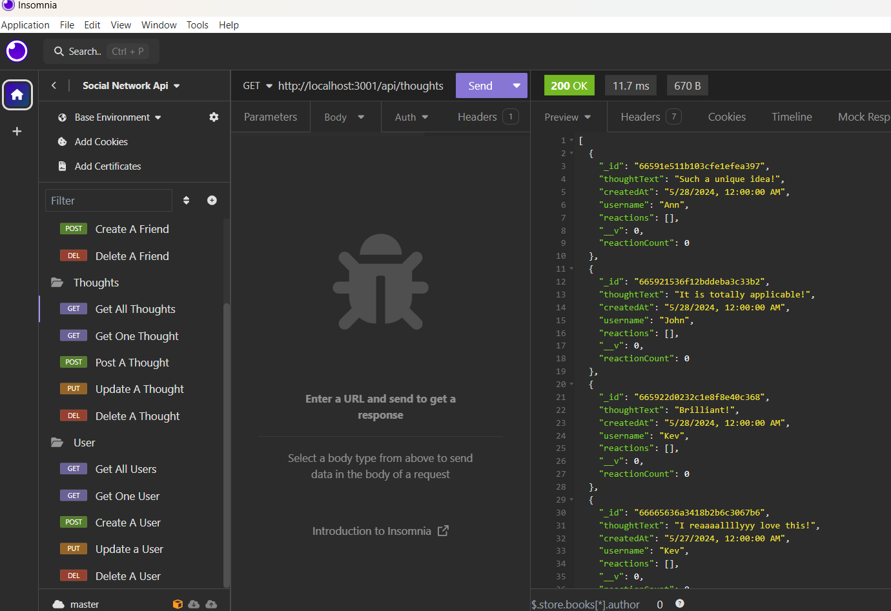
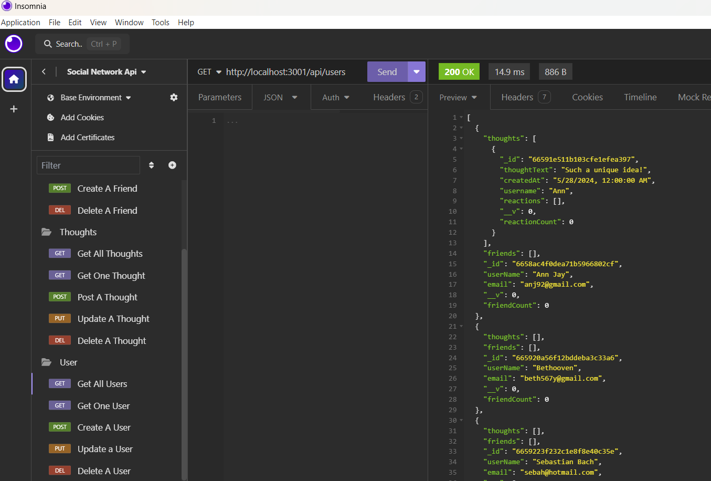

# Social Network Api
This project is an API for a social network web application where users can share their thoughts, react to friends’ thoughts, and create a friend list. The application is built using Express.js for routing, MongoDB as the NoSQL database, and Mongoose as the ODM (Object Data Modeling) library.  

    
   

# Link to watch the demonstration of API testing on Insomnia
https://drive.google.com/file/d/105i3u15Tzr44ddnnnFxPuTNNmh7ArBu2/view?usp=sharing   

# Technologies used
**Node.js** - JavaScript runtime environment that allows you to execute JavaScript code on the server side.  
Role in the Project: Provides the runtime environment for building the backend of the application.  

**Express.js** - Node.js web application framework that provides a robust set of features to develop web and mobile applications. 
Role in the Project: Used for setting up the server and routing. Handles HTTP requests and responses, defining endpoints for the API.  

**MongoDB** - NoSQL database that uses a flexible, JSON-like document format. >
Role in the Project: Serves as the database to store user data, thoughts, reactions, and friends. It is particularly suited for handling the unstructured and dynamic nature of social media data.   

**Mongoose** - Object Data Modeling (ODM) library for MongoDB and Node.js. It provides a straightforward, schema-based solution to model application data.  
Role in the Project: Facilitates interaction with MongoDB by providing schema validation, relationship management, and easy querying.    

**Insomnia** - REST API client that helps developers make HTTP requests and test APIs.  
Role in the Project: Used for testing the API endpoints. It allows you to make GET, POST, PUT, and DELETE requests to ensure the API functions correctly.    

**JavaScript** - versatile programming language commonly used for developing web applications.  
Role in the Project: Used for writing the backend code, defining logic for handling requests, managing data, and performing CRUD operations on the MongoDB database.